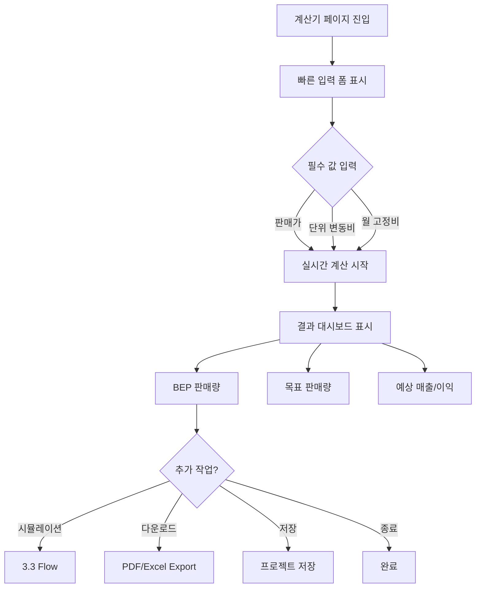
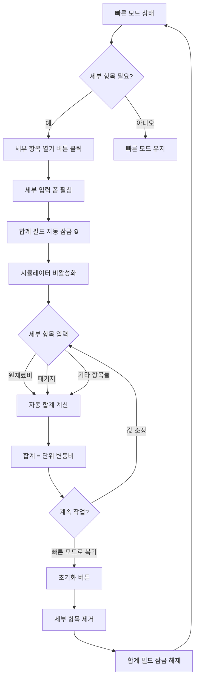
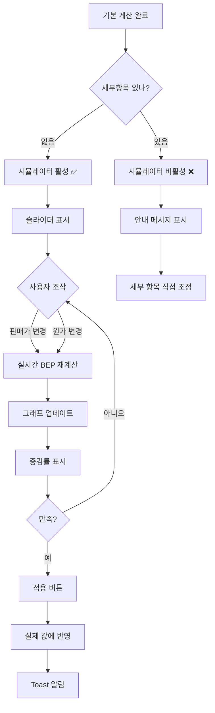
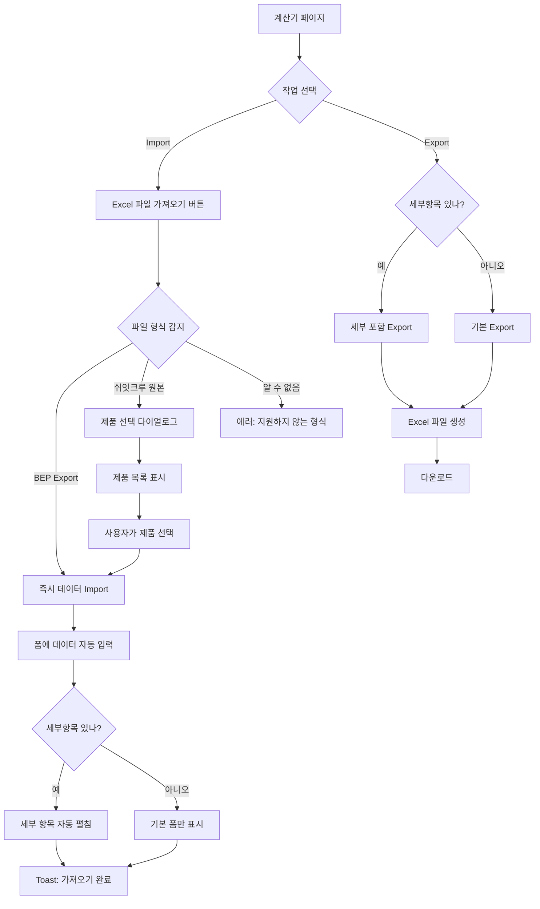
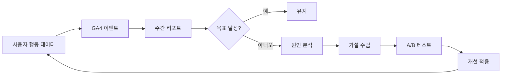

# BEP 마진계산기 User Flow 가이드

## 📌 문서 목적

이 문서는 BEP 마진계산기의 모든 사용자 흐름을 상세히 정의하여 다음을 달성합니다:

1. **기능 목적성 명확화** - 왜 이 기능이 존재하는가?
2. **일관된 UX 패턴** - 사용자에게 익숙한 인터페이스
3. **복잡도 관리** - 기능 추가 시 원칙 준수
4. **개발 가이드** - 새로운 개발자의 빠른 이해

---

## 🎯 1. 핵심 목적 및 가치

### 1.1 제품 핵심 가치
> **"엑셀 없이 5분 만에 손익분기점을 계산하고, 목표 수익 달성을 위한 판매량을 시각적으로 확인하세요."**

### 1.2 핵심 설계 원칙

| 원칙 | 설명 | 적용 예시 |
|------|------|----------|
| **5분 내 완료** | 첫 방문자가 5분 내 BEP 계산 완료 | 빠른 입력 모드 우선 표시 |
| **점진적 공개** | 복잡한 기능은 필요 시 노출 | 세부항목은 펼침으로 숨김 |
| **익숙한 패턴** | 사용자가 이미 아는 인터페이스 | Excel 합계 셀 패턴 적용 |
| **오류 방지** | 데이터 불일치 원천 차단 | 모드 분리로 충돌 방지 |
| **즉각 피드백** | 입력 즉시 결과 표시 | 실시간 계산 및 그래프 업데이트 |

### 1.3 성공 지표

| 지표 | 목표값 | 측정 방법 |
|------|--------|----------|
| 첫 계산 완료 시간 | ≤ 5분 | GA 이벤트 추적 |
| 재방문률 (30일) | ≥ 25% | 사용자 코호트 분석 |
| 세부항목 사용률 | 15-20% | 기능 사용 로그 |
| 시뮬레이션 사용률 | ≥ 60% | 슬라이더 조작 이벤트 |

---

## 👥 2. 사용자 페르소나 & 시나리오

### 페르소나 1: 예비 창업자 (주 타깃 70%)

**프로필:**
- 이름: 김민지 (28세)
- 배경: 핸드메이드 비누 온라인 판매 준비 중
- 엑셀 사용: 기본 수식 정도
- 목표: 판매가 결정 및 손익분기점 파악

**시나리오:**
```
[상황] 원재료비 계산 완료, 판매가 고민 중

[질문들]
Q1. "25,000원에 팔면 몇 개 팔아야 본전이지?"
Q2. "30,000원으로 올리면 판매량은 얼마나 줄어도 되나?"
Q3. "쿠팡 수수료 15%면 원가가 얼마나 증가하지?"

[사용 패턴]
1. 빠른 입력 (5분)
2. 가격 시뮬레이션 (2-3분)
3. PDF 다운로드
```

### 페르소나 2: 소규모 셀러 (부 타깃 20%)

**프로필:**
- 이름: 박준호 (35세)
- 배경: 네이버 스마트스토어 운영 6개월차
- 엑셀 사용: 능숙함
- 목표: 정밀한 원가 관리 및 시뮬레이션

**시나리오:**
```
[상황] 마켓 수수료 변경 대응

[질문들]
Q1. "수수료 15% → 18% 변경 시 영향은?"
Q2. "원재료 단가 협상으로 10% 절감하면?"
Q3. "가격 조정 vs 원가 절감, 어느 쪽이 나을까?"

[사용 패턴]
1. Excel Import (기존 데이터)
2. 세부항목 상세 입력 (10분)
3. 세부항목 직접 조정하며 비교
4. 프로젝트 저장
```

### 페르소나 3: 프리랜서 (부 타깃 10%)

**프로필:**
- 이름: 이서연 (32세)
- 배경: 디자인 프리랜서, 프로젝트 단가 책정
- 엑셀 사용: 기본
- 목표: 프로젝트 수익성 빠른 확인

**시나리오:**
```
[상황] 클라이언트 견적 제안 전

[질문들]
Q1. "이 프로젝트 단가 300만원으로 가능할까?"
Q2. "월 몇 건 수주해야 생활비 나올까?"

[사용 패턴]
1. 빠른 입력 (3분)
2. 목표 수익 입력
3. 결과 확인 후 종료
```

---

## 🔄 3. 상세 User Flow

### 3.1 기본 계산 Flow (빠른 모드)

#### 목적
초보 사용자도 5분 내에 BEP를 계산하고 의사결정할 수 있도록 지원

#### 흐름도


#### 상세 단계

| # | 사용자 액션 | 시스템 반응 | UI 피드백 | 소요 시간 |
|---|------------|------------|-----------|----------|
| 1 | 페이지 접근 | 빠른 입력 폼 표시 | 3개 필드만 보임 | 즉시 |
| 2 | 판매가 입력 (예: 50000) | 숫자 검증 | 실시간 포맷팅 (50,000원) | 5초 |
| 3 | 단위 변동비 입력 (예: 20000) | 공헌이익 계산 시작 | 공헌이익 30,000원 표시 | 5초 |
| 4 | 월 고정비 입력 (예: 3000000) | BEP 자동 계산 | 결과 카드 업데이트 | 5초 |
| 5 | (선택) 목표 수익 입력 | 목표 판매량 계산 | 목표 섹션 활성화 | 5초 |
| 6 | 결과 확인 | 그래프 표시 | 민감도 분석 차트 | 즉시 |

**총 소요 시간: 2-3분** ✅

#### UI 패턴

**입력 폼 (Simple First)**
```
┌─ 계산 입력 ─────────────────────┐
│                                 │
│ 판매가 ⓘ                        │
│ [50,000원                    ] │
│                                 │
│ 단위 변동비 ⓘ [세부 항목 ▼]    │
│ [20,000원                    ] │
│                                 │
│ 월 고정비 ⓘ [세부 항목 ▼]      │
│ [3,000,000원                 ] │
│                                 │
│ 목표 수익 (선택) ⓘ              │
│ [5,000,000원                 ] │
│                                 │
└─────────────────────────────────┘
```

#### 성공 기준
- ✅ 3개 필드만 필수 입력
- ✅ 입력 즉시 결과 표시 (200ms 디바운스)
- ✅ 5분 내 계산 완료율 ≥ 70%

---

### 3.2 세부항목 입력 Flow (상세 모드)

#### 목적
정밀한 원가 관리가 필요한 사용자에게 세부 항목별 입력 및 분석 기능 제공

#### 의사결정: 모드 분리 방식 채택

**채택된 패턴: Excel 합계 셀 보호 패턴**

| 비교 항목 | 채택 전 | 채택 후 |
|----------|---------|---------|
| 합계 필드 | 항상 편집 가능 | 세부항목 있으면 잠금 🔒 |
| 데이터 충돌 | 발생 가능 ❌ | 불가능 ✅ |
| 시뮬레이터 | 항상 활성 | 세부항목 모드에서 비활성 |
| 사용자 혼란 | 높음 | 낮음 |

#### 흐름도


#### 상세 단계

**Phase 1: 세부 항목 열기**

| # | 사용자 액션 | 시스템 반응 | UI 피드백 |
|---|------------|------------|-----------|
| 1 | "세부 항목 열기" 버튼 클릭 | 세부 입력 폼 펼침 | 애니메이션 전환 |
| 2 | - | 합계 필드 disabled | 🔒 아이콘 표시 |
| 3 | - | 시뮬레이터 비활성화 | 안내 메시지 표시 |

**Phase 2: 세부 항목 입력**

| # | 사용자 액션 | 시스템 반응 | UI 피드백 |
|---|------------|------------|-----------|
| 1 | 원재료비 입력 (예: 10000) | 자동 합계 계산 | 합계: 10,000원 |
| 2 | 패키지 입력 (예: 5000) | 합계 업데이트 | 합계: 15,000원 |
| 3 | 마켓수수료 입력 (예: 3000) | 합계 업데이트 | 합계: 18,000원 |
| 4 | 기타 입력 (예: 2000) | 합계 업데이트 | 합계: 20,000원 ✅ |
| 5 | - | 단위 변동비 = 20,000원 | BEP 자동 재계산 |

**Phase 3: 빠른 모드로 복귀**

| # | 사용자 액션 | 시스템 반응 | UI 피드백 |
|---|------------|------------|-----------|
| 1 | "초기화" 버튼 클릭 | 확인 모달 표시 | "세부 항목이 삭제됩니다" |
| 2 | 확인 | 세부 항목 모두 제거 | 폼 접힘 |
| 3 | - | 합계 필드 편집 가능 | 🔒 아이콘 제거 |
| 4 | - | 시뮬레이터 활성화 | 슬라이더 표시 |

#### UI 패턴

**세부 항목 펼친 상태**
```
┌─ 단위 변동비 ───────────────────────┐
│ 20,000원 [🔒]                       │
│ ℹ️ 세부항목으로 관리 중              │
│                                     │
│ ┌─ 세부 항목 (자동 합계) ──────┐   │
│ │                               │   │
│ │ 원재료비    [10,000원]  50%  │   │
│ │ 패키지      [ 5,000원]  25%  │   │
│ │ 택배박스    [ 2,000원]  10%  │   │
│ │ 마켓수수료  [ 3,000원]  15%  │   │
│ │ 배송비      [     0원]   0%  │   │
│ │ 기타        [     0원]   0%  │   │
│ │ ─────────────────────────── │   │
│ │ 합계        20,000원     ✅  │   │
│ │                               │   │
│ │ [초기화하여 직접 입력]        │   │
│ └───────────────────────────────┘   │
└─────────────────────────────────────┘
```

**시뮬레이터 비활성화 상태**
```
┌─ 시뮬레이션 [비활성] ──────────────┐
│ ℹ️ 세부 항목 모드                 │
│                                    │
│ 세부 항목 값을 직접 조정하여       │
│ 영향을 확인하세요.                 │
│                                    │
│ 💡 팁: 각 세부 항목을 조정하면     │
│       실시간으로 BEP가 재계산됩니다│
│                                    │
│ 시뮬레이터를 사용하려면            │
│ 세부 항목을 초기화하세요.          │
│                                    │
│ [▲ 세부 항목으로 이동]            │
└────────────────────────────────────┘
```

#### 익숙한 패턴 근거

| 참조 소프트웨어 | 유사 패턴 | 사용자 기대 |
|----------------|----------|------------|
| **Microsoft Excel** | 합계 셀 보호 | 수식 셀 직접 편집 시 수식 제거 경고 |
| **Google Sheets** | 자동 합계 | SUM() 함수로 관리되는 셀 직접 편집 불가 |
| **QuickBooks** | 상세 항목 우선 | 인보이스 총액은 라인 아이템 합계 |
| **Xero (회계)** | 잠금 필드 | 자동 계산 필드는 회색 배경 + 잠금 |

#### 성공 기준
- ✅ 세부항목 ↔ 합계 항상 일치
- ✅ 사용자 혼란 없음 (A/B 테스트)
- ✅ 세부항목 사용률 15-20%

---

### 3.3 시뮬레이션 Flow

#### 목적
"만약에(What-if)" 시나리오를 빠르게 테스트하여 최적 가격/원가 찾기

#### 시뮬레이터 활성화 조건

```typescript
// 의사 코드
const canSimulate =
  !hasVariableCostDetail &&  // 변동비 세부항목 없음
  !hasFixedCostDetail;       // 고정비 세부항목 없음

if (canSimulate) {
  // 시뮬레이터 활성화: 슬라이더로 조정 가능
} else {
  // 시뮬레이터 비활성화: 세부항목 직접 조정 안내
}
```

#### 흐름도


#### 상세 단계

**시나리오 A: 가격 인상 시뮬레이션**

| # | 사용자 액션 | 시스템 반응 | UI 피드백 | 인사이트 |
|---|------------|------------|-----------|----------|
| 1 | 판매가 슬라이더 조작<br>50,000 → 55,000원 | BEP 재계산 | BEP: 100개 → 86개 (-14%) | "가격 10% 인상 시<br>BEP 14% 감소" |
| 2 | 그래프 확인 | 민감도 곡선 업데이트 | 초록색 영역 증가 | 수익성 개선 확인 |
| 3 | "적용" 버튼 클릭 | 실제 판매가에 반영 | Toast: "적용 완료" | 새 가격 확정 |

**시나리오 B: 원가 절감 시뮬레이션**

| # | 사용자 액션 | 시스템 반응 | UI 피드백 | 인사이트 |
|---|------------|------------|-----------|----------|
| 1 | 원가 슬라이더 조작<br>20,000 → 18,000원 | 공헌이익 증가 | 공헌이익: 30,000 → 32,000원 | "원가 10% 절감 시<br>공헌이익 6.7% 증가" |
| 2 | BEP 확인 | BEP 감소 | BEP: 100개 → 94개 (-6%) | "원가 절감 효과 확인" |
| 3 | "적용" 버튼 클릭 | 원가에 반영 | Toast: "적용 완료" | 협상 목표 설정 |

#### UI 패턴

**활성 상태 (빠른 모드)**
```
┌─ 시뮬레이션 ─────────────────────────┐
│                                      │
│ 판매가                               │
│ 50,000원 [━━━●━━━] 55,000원         │
│ ▲ +10% (5,000원)                    │
│                                      │
│ 원가                                 │
│ 20,000원 [━━━━●━━] 18,000원         │
│ ▼ -10% (2,000원)                    │
│                                      │
│ ┌─ 시뮬레이션 결과 ─────────────┐   │
│ │ 공헌이익:    32,000원         │   │
│ │ 손익분기점:  86개 (↓ 14개)    │   │
│ │ 목표 판매량: 156개 (↓ 25개)   │   │
│ │                                │   │
│ │ 💡 가격 인상 + 원가 절감으로   │   │
│ │    BEP가 14% 감소했습니다     │   │
│ └────────────────────────────────┘   │
│                                      │
│ [초기화]           [적용하기] ✅    │
└──────────────────────────────────────┘
```

**비활성 상태 (세부 항목 모드)**
```
┌─ 시뮬레이션 [비활성] ────────────────┐
│ ℹ️ 세부 항목 모드                   │
│                                      │
│ 세부 항목 값을 직접 조정하여         │
│ 영향을 확인하세요.                   │
│                                      │
│ 예시:                                │
│ • 원재료비 10,000 → 9,000원         │
│   → BEP 즉시 재계산 ✅              │
│                                      │
│ 시뮬레이터를 사용하려면              │
│ 세부 항목을 초기화하세요.            │
│                                      │
│ [▲ 세부 항목으로 이동]              │
└──────────────────────────────────────┘
```

#### 성공 기준
- ✅ 시뮬레이션 사용률 ≥ 60%
- ✅ 슬라이더 조작 후 "적용" 전환율 ≥ 40%
- ✅ 실시간 반응 속도 < 100ms

---

### 3.4 Import/Export Flow

#### 목적
Excel 기반 데이터와의 양방향 연동으로 기존 워크플로우와 통합

#### 흐름도


#### 상세 단계

**Import 시나리오 1: BEP Export 재Import**

| # | 사용자 액션 | 시스템 반응 | UI 피드백 |
|---|------------|------------|-----------|
| 1 | "Excel 가져오기" 버튼 | 파일 선택 다이얼로그 | OS 파일 탐색기 열림 |
| 2 | BEP_Export.xlsx 선택 | 파일 형식 감지 | 로딩 인디케이터 |
| 3 | - | Inputs 시트 파싱 | "BEP Export 파일 감지" |
| 4 | - | 데이터 자동 입력 | 폼 필드 채워짐 |
| 5 | - | 세부항목 있으면 펼침 | 애니메이션 전환 |
| 6 | - | 계산 실행 | 결과 표시 |
| 7 | - | Toast 알림 | "가져오기 완료" ✅ |

**Import 시나리오 2: 쉬잇크루 원본 Import**

| # | 사용자 액션 | 시스템 반응 | UI 피드백 |
|---|------------|------------|-----------|
| 1 | 쉬잇크루.xlsx 선택 | 파일 형식 감지 | "쉬잇크루 파일 감지" |
| 2 | - | 제품 목록 파싱 | 로딩 3초 |
| 3 | - | 제품 선택 다이얼로그 | 목록 표시 (예: 5개 제품) |
| 4 | "대박날 나의 아이템" 선택 | 데이터 변환 | 미리보기 표시 |
| 5 | "적용" 버튼 | 폼에 데이터 입력 | 세부항목 자동 펼침 |
| 6 | - | 계산 실행 | 결과 표시 |

**Export 시나리오**

| # | 사용자 액션 | 시스템 반응 | UI 피드백 |
|---|------------|------------|-----------|
| 1 | "Excel 다운로드" 버튼 | 데이터 검증 | 계산 완료 확인 |
| 2 | - | Excel 파일 생성 | 로딩 2-3초 |
| 3 | - | 5개 시트 생성 | 진행률 표시 |
| 4 | - | 다운로드 시작 | 브라우저 다운로드 |
| 5 | - | Toast 알림 | "다운로드 완료" ✅ |

#### 성공 기준
- ✅ BEP Export 재Import 정확도 100%
- ✅ 쉬잇크루 파일 파싱 성공률 ≥ 95%
- ✅ Export 파일 생성 시간 < 5초

---

### 3.5 프로젝트 저장 Flow

#### 목적
반복 사용자를 위한 데이터 보존 및 히스토리 관리

#### 흐름도
```mermaid
graph TD
    A[계산 완료] --> B["프로젝트 저장" 버튼]
    B --> C{로그인 여부}
    C -->|아니오| D[로그인 모달]
    C -->|예| E[프로젝트명 입력 다이얼로그]
    D --> F{로그인 방식}
    F -->|구글| G[OAuth 로그인]
    F -->|이메일| H[이메일 로그인]
    G --> E
    H --> E
    E --> I[프로젝트명 입력]
    I --> J[Supabase 저장]
    J --> K[Toast: 저장 완료]
    K --> L[프로젝트 ID 생성]
    L --> M{다음 작업}
    M -->|목록 보기| N[/projects 이동]
    M -->|계속 작업| O[현재 페이지 유지]
```

---

## 🎨 4. UI 패턴 라이브러리

### 4.1 입력 패턴

#### Pattern A: 즉시 반응 (Immediate Feedback)
**사용 위치:** 기본 계산 입력

**동작:**
- 입력 즉시 검증
- 200ms 디바운스 후 계산
- 실시간 결과 업데이트

**코드 예시:**
```typescript
const [value, setValue] = useState("");

useEffect(() => {
  const timer = setTimeout(() => {
    calculate(value);
  }, 200);
  return () => clearTimeout(timer);
}, [value]);
```

#### Pattern B: 명시적 제출 (Explicit Submit)
**사용 위치:** 세부항목 초기화

**동작:**
- 위험한 액션 (데이터 삭제)
- 확인 모달 표시
- 명시적 "확인" 버튼

---

### 4.2 피드백 패턴

#### Pattern A: Toast 알림
**사용 시점:**
- Import 완료
- Export 완료
- 저장 완료
- 시뮬레이션 적용

**표시 위치:** 화면 우측 하단
**표시 시간:** 3초

#### Pattern B: 인라인 검증
**사용 시점:**
- 입력 값 오류 (예: 음수)
- 필수 필드 누락
- 세부항목 합계 불일치

**표시 위치:** 해당 필드 하단
**색상:** 빨간색

---

### 4.3 동기화 패턴 ⭐

#### Pattern: Excel 합계 셀 보호

**원칙:**
1. 세부항목 = 소스 오브 트루스
2. 합계 필드 = 자동 계산 결과 (읽기 전용)
3. 모드 전환은 명시적 액션 ("초기화" 버튼)

**상태 전환:**
```
[빠른 모드]
├─ 합계 필드: 편집 가능 ✅
├─ 세부 항목: 숨김
└─ 시뮬레이터: 활성 ✅

        ↓ 세부 항목 열기

[세부 항목 모드]
├─ 합계 필드: 잠금 🔒
├─ 세부 항목: 표시 & 편집 가능
└─ 시뮬레이터: 비활성 ❌

        ↓ 초기화 (확인 모달)

[빠른 모드] (복귀)
```

**구현 체크리스트:**
- [ ] 세부항목 존재 여부 감지 로직
- [ ] 합계 필드 `disabled` 속성 제어
- [ ] 🔒 아이콘 및 안내 메시지
- [ ] 초기화 버튼 + 확인 모달
- [ ] 시뮬레이터 `disabled` 속성 제어

---

### 4.4 모달/다이얼로그 패턴

#### Pattern A: 정보 수집 모달
**사용 위치:** 프로젝트 저장

**구조:**
- 제목
- 입력 필드 (프로젝트명)
- 취소 / 확인 버튼

#### Pattern B: 확인 모달 (Destructive Action)
**사용 위치:** 세부항목 초기화

**구조:**
- 경고 아이콘 ⚠️
- 설명: "세부 항목이 삭제됩니다"
- 취소 / 확인 버튼 (빨간색)

#### Pattern C: 선택 모달
**사용 위치:** 쉬잇크루 제품 선택

**구조:**
- 검색 필드
- 제품 목록 (카드 형태)
- 미리보기
- 취소 / 적용 버튼

---

## 📊 5. 기능 우선순위 매트릭스

### 5.1 핵심 vs 부가 기능

```
              높음 │     B      │     A     │
가치          │  고급기능  │ 핵심기능  │
(사용자)      │  (20% 사용) │ (80% 사용) │
              ────┼───────────┼───────────┤
              낮음 │     D      │     C     │
                  │  제거대상  │ 유지보수  │
                  └───────────┴───────────┘
                    높음      →     낮음
                    구현 복잡도
```

### 5.2 기능 분류

#### Quadrant A: 핵심 기능 (Must Have)
- [A1] 기본 계산 (판매가, 원가, 고정비)
- [A2] BEP 계산 및 표시
- [A3] 실시간 결과 업데이트
- [A4] 민감도 분석 그래프
- [A5] 빠른 모드 시뮬레이터

**원칙:** 5분 내 완료, 절대 복잡하게 만들지 않음

#### Quadrant B: 고급 기능 (Nice to Have)
- [B1] 세부항목 상세 입력
- [B2] Excel Import/Export
- [B3] 프로젝트 저장/불러오기
- [B4] PDF 리포트

**원칙:** 점진적 공개, 선택적 사용

#### Quadrant C: 유지보수 (Keep)
- [C1] 반응형 UI
- [C2] 다국어 지원 (향후)
- [C3] 도움말 Tooltip

**원칙:** 기본 품질 유지

#### Quadrant D: 제거 대상 (Remove)
- [D1] ~~복잡한 다중 시나리오 비교~~ → 제거
- [D2] ~~고급 통계 분석~~ → PRO 버전으로 이동

---

## 🛡️ 6. 복잡도 관리 원칙

### 6.1 새 기능 추가 시 체크리스트

```markdown
## 기능 추가 제안: [기능명]

### 1단계: 목적성 검증
- [ ] PRD 핵심 가치와 부합하는가?
- [ ] "5분 내 계산" 목표를 방해하지 않는가?
- [ ] 80% 사용자에게 필요한가, 20% 사용자를 위한가?

### 2단계: 사용자 시나리오 검증
- [ ] 실제 사용자 페인 포인트를 해결하는가?
- [ ] 대체 방법(workaround)이 있는가?
- [ ] A/B 테스트 가능한가?

### 3단계: UI 복잡도 검증
- [ ] 기존 UI 패턴을 재사용하는가?
- [ ] 새로운 학습이 필요한가?
- [ ] 점진적 공개 원칙을 따르는가?

### 4단계: 기술 복잡도 검증
- [ ] 구현 시간 < 예상 가치인가?
- [ ] 유지보수 부담은 얼마인가?
- [ ] 성능 영향은 얼마인가?

### 최종 결정
- [ ] 승인 → Quadrant A or B 배치
- [ ] 보류 → Backlog
- [ ] 거절 → 이유 문서화
```

### 6.2 리팩토링 기준

**언제 리팩토링하는가?**
1. 같은 로직이 3번 반복되면 → 함수/컴포넌트 분리
2. 파일이 500줄 초과 → 모듈 분리 고려
3. 사용자 혼란 리포트 발생 → UI 재설계

**언제 리팩토링하지 않는가?**
1. 기능이 정상 작동하고 성능 문제 없음
2. 레거시 코드지만 변경 리스크 높음
3. 곧 재작성 예정

---

## 📈 7. 성공 측정 및 개선

### 7.1 핵심 지표 (North Star Metrics)

| 지표 | 목표 | 측정 주기 | 액션 트리거 |
|------|------|----------|------------|
| 첫 계산 완료 시간 | ≤ 5분 | 주간 | > 6분 시 UI 개선 |
| 세부항목 사용률 | 15-20% | 월간 | < 10% 시 UX 개선 |
| 시뮬레이션 사용률 | ≥ 60% | 주간 | < 50% 시 가이드 추가 |
| 재방문률 (30일) | ≥ 25% | 월간 | < 20% 시 기능 점검 |

### 7.2 사용자 피드백 루프



---

## 🔄 8. 버전 관리

### 8.1 문서 히스토리

| 버전 | 날짜 | 변경 사항 | 작성자 |
|------|------|----------|--------|
| 1.0 | 2025-10-15 | 초기 작성 (모드 분리 방식 채택) | Claude |
| - | - | - | - |

### 8.2 주요 의사결정 기록

#### Decision 001: 세부항목 동기화 방식
- **날짜:** 2025-10-15
- **문제:** 단위 변동비 ↔ 세부항목 동기화 충돌
- **옵션:** A) 비율 조정, B) 모드 분리, C) 가격만 시뮬
- **결정:** Option B+ (모드 분리 + 명확한 안내)
- **근거:** 5분 목표 보존, 오류 방지, 확장 가능성

#### Decision 002: 시뮬레이터 활성화 조건
- **날짜:** 2025-10-15
- **문제:** 시뮬레이터 vs 세부항목 충돌
- **결정:** 세부항목 모드에서 시뮬레이터 비활성화
- **근거:** 사용자 혼란 방지, 명확한 워크플로우

---

## 📚 9. 참고 자료

### 9.1 내부 문서
- [PRD](./prd.md) - 제품 요구사항 정의
- [IA](./ia.md) - 정보 구조
- [Step-by-Step](../vooster-docs/step-by-step.md) - 개발 가이드

### 9.2 디자인 참고
- [Laws of UX](https://lawsofux.com/)
  - Hick's Law: 선택지 최소화
  - Progressive Disclosure: 점진적 공개
- [Microsoft Fluent Design](https://fluent2.microsoft.design/)
  - 입력 필드 상태 (enabled/disabled)

### 9.3 경쟁사 분석
- **엑셀 템플릿:** 복잡하지만 강력
- **온라인 BEP 계산기:** 단순하지만 제한적
- **우리의 차별점:** 단순함 + 고급 기능 균형

---

## ✅ 10. 체크리스트

### 개발자 온보딩
- [ ] 이 문서를 처음부터 끝까지 읽었는가?
- [ ] 핵심 원칙 5가지를 이해했는가?
- [ ] 각 Flow의 목적을 설명할 수 있는가?
- [ ] 의사결정 근거를 알고 있는가?

### 새 기능 구현 전
- [ ] 이 문서의 "복잡도 관리 원칙" 확인
- [ ] 기능 추가 체크리스트 작성
- [ ] UI 패턴 라이브러리 재사용 검토
- [ ] 사용자 시나리오 작성

### PR 리뷰 시
- [ ] 핵심 원칙 준수 여부
- [ ] User Flow 문서 업데이트 여부
- [ ] 성공 기준 달성 여부

---

**작성일:** 2025-10-15
**최종 업데이트:** 2025-10-15
**문서 상태:** 승인됨 ✅

이 문서는 BEP 마진계산기의 "헌법"입니다. 모든 의사결정은 이 문서를 기준으로 합니다.
